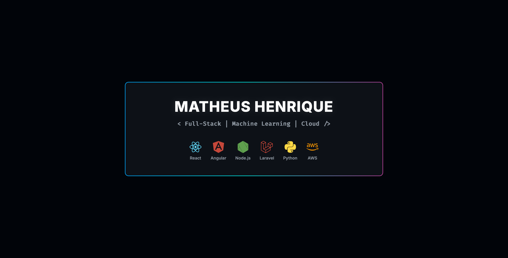

  

 

---

### 👤 Sobre Mim

Sou um desenvolvedor focado em construir soluções inteligentes que unem a robustez do **Back-end** com o poder analítico de **Machine Learning**. Atualmente, projeto arquiteturas escaláveis em ambientes Cloud, priorizando performance, automação e decisões baseadas em dados.

> **Perfil Profissional:** Prático, analítico, calculista e altamente orientado a resultados.

---

### 🚀 Projetos em Destaque e Foco de Atuação

Aqui estão as áreas onde tenho gerado mais impacto e desenvolvido soluções arquiteturais:

* 👁️ **Visão Computacional & Monitoramento:** Desenvolvimento de interfaces customizadas para ecossistemas Intelbras.
* 📊 **Engenharia de Dados:** Pipelines automatizados de extração e integração complexa entre Excel e bancos relacionais (SQL Server) via Python.
* ☁️ **Infraestrutura SaaS & Cloud:** Implementação e gestão de servidores locais de alta performance (Xeon/Docker) para hospedagem e escalabilidade de aplicações.
* 🔌 **Desenvolvimento IoT:** Implementação de automações e análises de dados coletados na borda para otimização de recursos físicos.

---

### 🛠️ Stack Tecnológica

  <h4>Front-end & UI</h4>
  
  
  
  
   <h4>Back-end & Frameworks</h4>
  
  
  
  
  
  
   <h4>Machine Learning & Dados</h4>
  
  
  

   <h4>Cloud, Infraestrutura & DevOps</h4>
  
  
  

---

### 📈 Atividade e Performance

  
  

---

### 📫 Vamos construir o futuro juntos?

  
<em>"Transformando dados em decisões e código em soluções de impacto."</em>

  
  

